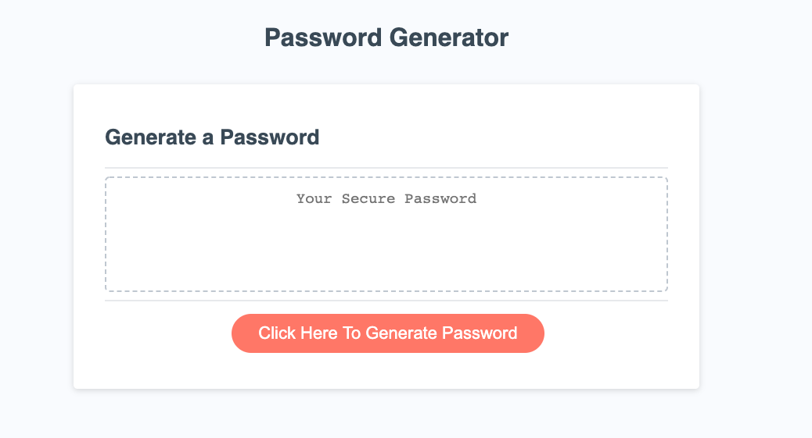
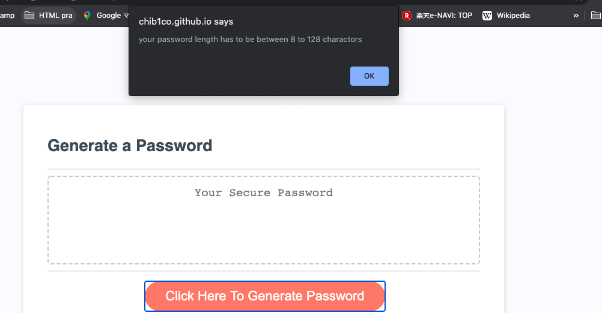
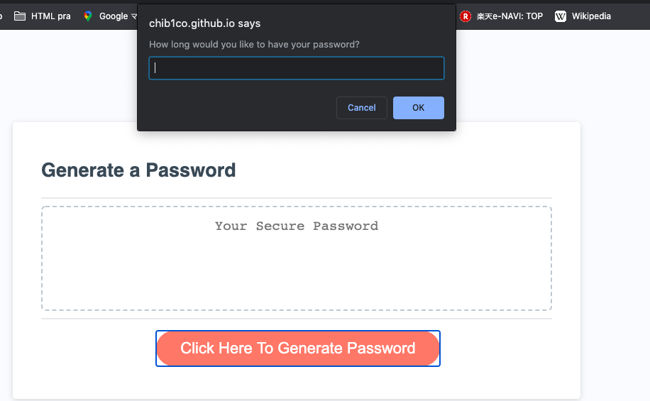
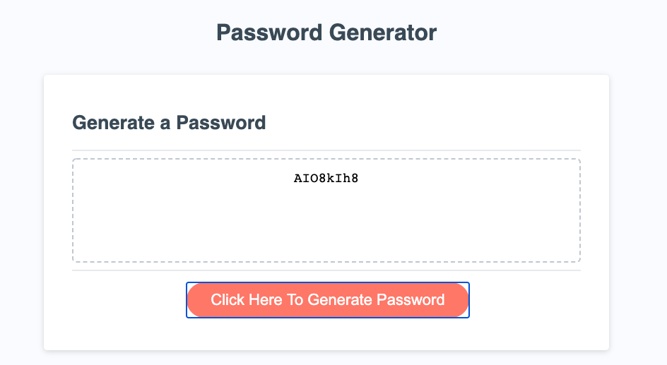

# Homework_Week3
This is 3rd week homework of BCS. 
I have made password generator used Javascript file

## Criteria
 * WHEN I click the button to generate a password
   THEN I am presented with a series of prompts for password criteria
    * Click the botton and computer start asking qustions to chose if user want to use Lowercase, Uppercase, Numbers and Symbold in their password
    
      

 * THEN I choose a length of at least 8 characters and no more than 128 characters
    * Type how long the user want the password to be. If user input the number not match between 8 -128 charactor, computer give the user an alert.
    

 * WHEN all prompts are answered
    * Generated password is to be shown on textarea 
    * If the user click again, user can go same confirm and promt again to generate new password
    
# Additional
  * I know apprearence is part of the criteria. But I have just changed 2 things. 
     * 1. changed bottn color. Just because red botton seems warining sign to me. 
     * 2. Changed the text of the botton to "Click Here To Generate Password" so easier for user to know what they need to do. I thought.    

# What I learned from this homework
 * I have started this course without any background. So when I was using internet just as regular life, I was not thinking about how all those function is working behind the screen which I was seeing. This is defenitly not easy to understand, I still have so many questions and things I need to work to better understanding. But I am still enjoying what I am learning everyday and knowing how this web world has been created. 

